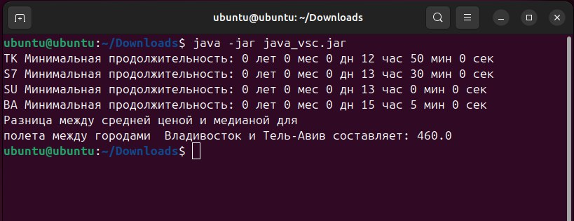

# Test
Напишите программу на языке программирования java, которая прочитает файл tickets.json и рассчитает:
- Минимальное время полета между городами Владивосток и Тель-Авив для каждого авиаперевозчика
- Разницу между средней ценой  и медианой для полета между городами  Владивосток и Тель-Авив

Программа должна вызываться из командной строки Linux, результаты должны быть представлены в текстовом виде. 
В качестве результата нужно прислать ответы на поставленные вопросы и ссылку на исходный код.

# Вывод
    TK Минимальная продолжительность: 0 лет 0 мес 0 дн 12 час 50 мин 0 сек 
    S7 Минимальная продолжительность: 0 лет 0 мес 0 дн 13 час 30 мин 0 сек
    SU Минимальная продолжительность: 0 лет 0 мес 0 дн 13 час 0 мин 0 сек
    BA Минимальная продолжительность: 0 лет 0 мес 0 дн 15 час 5 мин 0 сек
    Разницa между средней ценой и медианой для
    полета между городами  Владивосток и Тель-Авив составляет: 460.0

